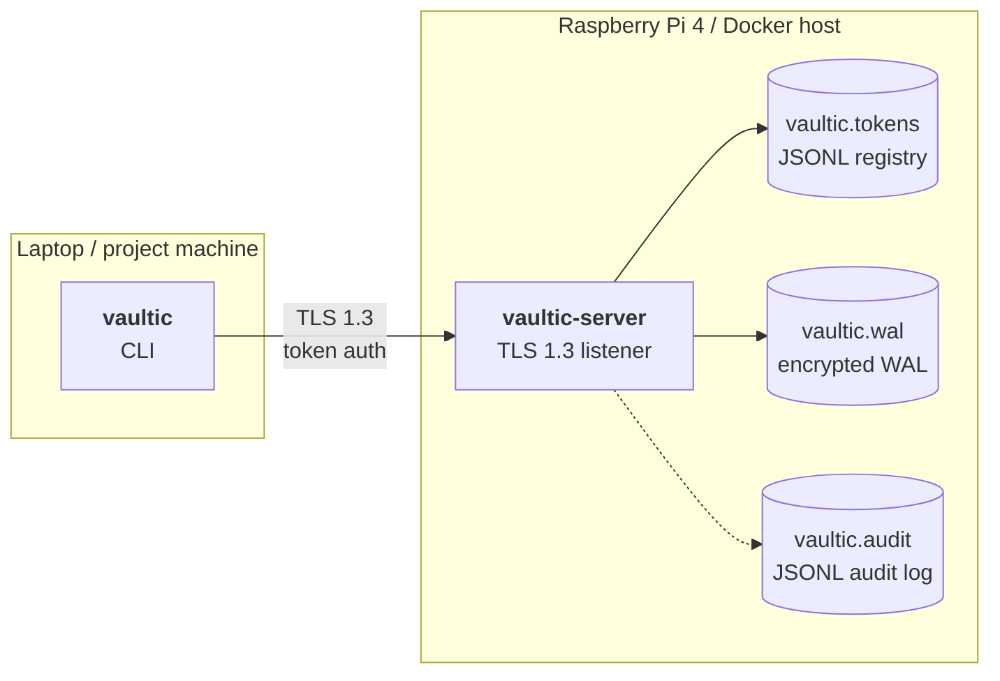

# Vaultic

> A self-hosted encrypted key-value store written in Go. Replace scattered `.env` files with a single vault you run on your own machine.

WAL-backed persistence, AES-256-GCM at rest, TLS 1.3 transport, namespace-scoped tokens.

---

> **⚠️ Disclaimer — this is a learning project**
>
> Vaultic is my first serious Go codebase, built primarily to learn storage engines, cryptography, and distributed-systems primitives. The crypto is implemented carefully using `crypto/aes`, `crypto/tls`, and `golang.org/x/crypto/argon2`, but the system has **not received independent security review**.
>
> **Don't use it for real secrets without understanding the trade-offs.**

---

## What it does

```
$ vaultic-server                                    # Pi or Docker host
Master password: ••••••••
TLS fingerprint: 2C:18:63:96:E7:7B:E6:58:...:84
vaultic-server listening on 127.0.0.1:7700

$ vaultic set openclaw:telegram_token abc123       # laptop
OK

$ vaultic get openclaw:telegram_token
abc123

$ vaultic export openclaw --format env > openclaw.env
```

Hierarchical keys group by project (`openclaw:`, `gcp:`, `aws:`). Per-project export to `.env` or JSON. CLI client and server speak a small text protocol over TLS.

## Architecture



```
┌─────────────────────────────────────────────────────────┐
│  vaultic-server (single binary)                         │
│                                                          │
│  ┌────────────────────────────────────────────────────┐ │
│  │ TLS 1.3 listener (cert pinned by client)           │ │
│  └─────────────────────┬──────────────────────────────┘ │
│                        │                                 │
│  ┌─────────────────────▼──────────────────────────────┐ │
│  │ Token auth (sha256-hashed, per-namespace perms)    │ │
│  └─────────────────────┬──────────────────────────────┘ │
│                        │                                 │
│  ┌─────────────────────▼──────────────────────────────┐ │
│  │ Command dispatch (SET / GET / DELETE / LIST)       │ │
│  └─────────────────────┬──────────────────────────────┘ │
│                        │                                 │
│  ┌─────────────────────▼──────────────────────────────┐ │
│  │ AES-256-GCM encryption layer                       │ │
│  └─────────────────────┬──────────────────────────────┘ │
│                        │                                 │
│  ┌─────────────────────▼──────────────────────────────┐ │
│  │ Write-ahead log (durable, crash-recoverable)       │ │
│  └─────────────────────┬──────────────────────────────┘ │
│                        │                                 │
│  ┌─────────────────────▼──────────────────────────────┐ │
│  │ In-memory hashmap (rebuilt from WAL replay)        │ │
│  └────────────────────────────────────────────────────┘ │
└─────────────────────────────────────────────────────────┘
```

## Quick start

```bash
# Build both binaries
go build -o vaultic-server ./cmd/vaultic-server
go build -o vaultic ./cmd/vaultic

# Start the server (prompts for master password, generates TLS cert + WAL on first run)
./vaultic-server

# In another terminal — talk to it
./vaultic set openai:api_key sk-abc123
./vaultic get openai:api_key
./vaultic list openai:
./vaultic export openai --format env
```

Requires Go 1.22+. Tested on macOS (Apple Silicon) and Linux ARM64 (Raspberry Pi 4).

## Features

### Storage
- **Write-ahead log** with `fsync` per write — survives `kill -9` and power loss
- **In-memory hashmap** rebuilt by replaying the WAL on startup
- Append-only WAL format, line-based for inspectability

### Security
- **AES-256-GCM** authenticated encryption for every value
- **Argon2id** key derivation (`time=3, memory=64 MiB, parallelism=4`)
- **Master password** never persisted; key derived in-memory and zeroed after use
- **TLS 1.3 only** transport with self-signed ECDSA P-256 certs auto-generated on first run
- **Cert pinning** on the client (only the server's specific cert is trusted)
- **Token-based auth** with SHA-256-hashed registry, constant-time comparison
- **Per-namespace permissions** (`r`, `rw`, `admin`)

### Network protocol
- Custom text-based wire protocol (Redis-flavored) over TCP
- Goroutine-per-connection, mutex-protected store
- Graceful shutdown via `signal.NotifyContext` + `WaitGroup`

### CLI
- One-shot mode (`vaultic set foo bar`) for shell pipelines
- Interactive REPL (`vaultic` with no args)
- `.env` and JSON export/import with strict (no-expansion) parser
- Hierarchical namespaces (`openclaw:telegram_token`, `adpulse:meta_key`)

## Roadmap

| Milestone | Focus | Status |
|-----------|-------|--------|
| 1 | Hello Go — REPL with in-memory map | ✅ Done |
| 2 | Write-ahead log + crash recovery | ✅ Done |
| 3 | Encryption (Argon2id + AES-GCM) | ✅ Done |
| 4 | TCP server + CLI client | ✅ Done |
| 5 | Namespaces + `.env` import/export | ✅ Done |
| 6 | TLS + token-based access control | 🟡 In progress |
| 7 | HTTP REST API + Go client library | Planned |
| 8 | Docker, Home Assistant add-on, GitHub release | Planned |

## Tech stack

| Layer | Choice | Why |
|-------|--------|-----|
| Language | Go 1.22+ | Static binaries, great stdlib for crypto/networking, simple concurrency |
| Storage | Custom WAL + in-memory map | Learning vehicle; fits the access pattern (small, frequent reads) |
| Encryption | AES-256-GCM via `crypto/aes` + `crypto/cipher` | Authenticated encryption is non-negotiable for at-rest secrets |
| KDF | Argon2id via `golang.org/x/crypto/argon2` | Memory-hard, modern recommendation (winner of 2015 PHC) |
| Transport | TLS 1.3 via `crypto/tls` | 1-RTT handshake, forward secrecy by default, no weak ciphers |
| Cert | ECDSA P-256 self-signed | Smaller than RSA-3072 with equivalent strength; we control both ends |
| Auth | SHA-256-hashed tokens, JSONL registry | Hashed at rest so leaked registry isn't useful; append-only for revocation |
| Tests | `testing` + `crypto/subtle` for timing safety | Race detector clean across all packages |

No third-party dependencies outside `golang.org/x/crypto` and `golang.org/x/term` — stdlib does the heavy lifting.

## Project structure

```
vaultic/
├── cmd/
│   ├── vaultic-server/    # daemon: TLS listener, master-password gate, token admin
│   └── vaultic/           # CLI client: one-shot + REPL modes
├── pkg/
│   └── vault/             # Store engine — WAL, encryption, replay (importable library)
├── internal/
│   ├── protocol/          # TCP server + client primitives + wire protocol
│   ├── tlsutil/           # Self-signed cert auto-generation
│   ├── auth/              # Token registry + per-namespace permissions
│   └── dotenv/            # Strict .env parser/encoder (no shell expansion)
└── go.mod
```

`pkg/` = exportable library (used by future Go client, M7). `internal/` = private to this repo, compiler-enforced.

## Wire protocol

Newline-delimited text over TLS. Inspectable with `openssl s_client`:

```
Client → Server     Server → Client
─────────────────   ───────────────
AUTH vt_iJYxk...    OK
SET foo bar         OK
GET foo             VALUE bar
GET nonexistent     ERR not found
LIST openclaw:      VALUE openclaw:foo=bar
                    VALUE openclaw:hello=world
                    END
QUIT                BYE
```

Multi-line responses (LIST) terminate with `END\n`. Errors are `ERR <message>\n`.

## Tests

```bash
go test -race ./...
```

All packages have unit + integration tests. Race-detector clean. The TCP server tests spin up a real listener on a random port and exercise the wire protocol end to end, including TLS handshake and untrusted-cert rejection.

## What I learned

Concrete things this project taught me that I didn't know before:

- **`fsync` vs `write` semantics** — why "successful return from write" doesn't mean "on disk," and why a WAL needs both.
- **Why authenticated encryption matters** — bare AES-CBC is silently dangerous. GCM's auth tag is what makes wrong-password detection work.
- **Salt vs nonce** — easy to conflate; they're solving different problems (KDF uniqueness vs AEAD uniqueness).
- **Constant-time comparison** — `crypto/subtle` exists for a reason; timing attacks on naive `==` are real CVEs.
- **Self-signed certificate pinning** — strictly more secure than the system trust store for known peers; the right tool when you control both ends.
- **Goroutine-per-connection + WaitGroup graceful shutdown** — the canonical Go server pattern; clean once you've internalized `<-ctx.Done()` as "park here until cancelled."
- **TCP is bytes, not messages** — every protocol invents its own framing (newlines, length prefixes, sentinels). Vaultic uses newlines + an `END` terminator for multi-line responses, same shape as memcached and SMTP.
- **`cmd/`/`pkg/`/`internal/` layout** — the package boundary becomes a real privacy boundary, not just a filing convention.

The codebase is small enough (~2000 lines) that every line was a deliberate decision rather than copy-paste from a tutorial.

## License

MIT — see [LICENSE](./LICENSE).

## Author

Alexander Thorsen ([@Xantico12](https://github.com/Xantico12)) — software engineering student at Aarhus University.
