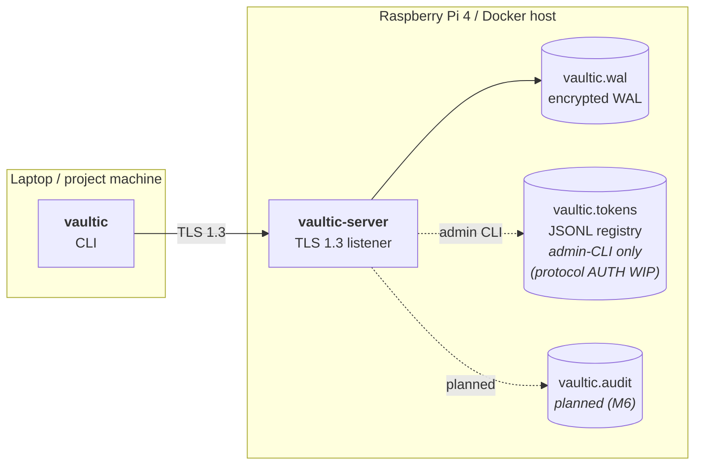

# Vaultic

> A self-hosted encrypted key-value store written in Go. Replace scattered `.env` files with a single vault you run on your own machine.

WAL-backed persistence, AES-256-GCM at rest, TLS 1.3 transport. Token auth and audit logging are in progress — see [Current status](#current-status) below.

---

> **⚠️ Disclaimer — this is a learning project**
>
> Vaultic is my first serious Go codebase, built primarily to learn storage engines, cryptography, and distributed-systems primitives. The crypto is implemented carefully using `crypto/aes`, `crypto/tls`, and `golang.org/x/crypto/argon2`, but the system has **not received independent security review**.
>
> **Don't use it for real secrets without understanding the trade-offs.** See the [Threat model](#threat-model) section for what Vaultic does and does not protect against.

---

## Current status

Vaultic is a work-in-progress learning project. Versioned at **v0.5.0**.

**Implemented today:**
- Encrypted WAL persistence with `fsync`-per-write durability
- AES-256-GCM at rest, Argon2id master-password key derivation
- TLS 1.3 client/server transport with self-signed cert auto-generation and client-side cert pinning
- TCP wire protocol with goroutine-per-connection and graceful shutdown
- CLI with one-shot and REPL modes, `.env` and JSON import/export
- Hierarchical-key namespaces (`openclaw:telegram_token`)
- Token registry and admin commands (`vaultic-server token create/list/revoke`)

**In progress (M6):**
- Requiring `AUTH <token>` on every protocol connection
- Per-command authorization against the token's namespace permissions
- Append-only audit log (JSONL) for every authenticated operation
- Per-token rate limiting

**Planned (M7–M8):**
- HTTP REST API parallel to the TCP protocol
- Importable Go client library for project integrations
- Docker multi-arch images, Home Assistant add-on, GitHub Actions CI

## What it does

```
$ vaultic-server                                    # Pi or Docker host
Master password: ••••••••
TLS fingerprint: 2C:18:63:96:E7:7B:E6:58:...:84
vaultic-server listening on 127.0.0.1:7700

$ vaultic set openclaw:telegram_token abc123       # laptop
OK

$ vaultic get openclaw:telegram_token
abc123

$ vaultic export openclaw --format env > openclaw.env
```

Hierarchical keys group by project (`openclaw:`, `gcp:`, `aws:`). Per-project export to `.env` or JSON. CLI client and server speak a small text protocol over TLS.

## Architecture



Solid arrows are live data paths. Dashed arrows are admin-CLI-only or planned. The TLS layer and WAL are fully wired; the token registry exists on disk and via admin commands but the protocol does not yet enforce per-connection authentication.

```
┌─────────────────────────────────────────────────────────┐
│  vaultic-server (single binary)                         │
│                                                          │
│  ┌────────────────────────────────────────────────────┐ │
│  │ TLS 1.3 listener (cert pinned by client)           │ │
│  └─────────────────────┬──────────────────────────────┘ │
│                        │                                 │
│  ┌─────────────────────▼──────────────────────────────┐ │
│  │ Command dispatch (SET / GET / DELETE / LIST)       │ │
│  └─────────────────────┬──────────────────────────────┘ │
│                        │                                 │
│  ┌─────────────────────▼──────────────────────────────┐ │
│  │ AES-256-GCM encryption layer                       │ │
│  └─────────────────────┬──────────────────────────────┘ │
│                        │                                 │
│  ┌─────────────────────▼──────────────────────────────┐ │
│  │ Write-ahead log (durable, crash-recoverable)       │ │
│  └─────────────────────┬──────────────────────────────┘ │
│                        │                                 │
│  ┌─────────────────────▼──────────────────────────────┐ │
│  │ In-memory hashmap (rebuilt from WAL replay)        │ │
│  └────────────────────────────────────────────────────┘ │
└─────────────────────────────────────────────────────────┘
```

## Quick start

```bash
# Build both binaries
go build -o vaultic-server ./cmd/vaultic-server
go build -o vaultic ./cmd/vaultic

# Start the server (prompts for master password; generates TLS cert + WAL on first run)
./vaultic-server

# In another terminal — talk to it
./vaultic set openai:api_key sk-abc123
./vaultic get openai:api_key
./vaultic list openai:
./vaultic export openai --format env
```

Built and tested with Go 1.26 (see `go.mod`). Runs on macOS (Apple Silicon) and Linux ARM64 (Raspberry Pi 4).

## Threat model

Vaultic is intended to protect:

- **The WAL file at rest** — if `vaultic.wal` is copied without the master password, every value is AES-256-GCM-encrypted and the auth tag prevents tampering.
- **Client/server traffic in transit** — TLS 1.3 with client-side cert pinning prevents passive network observers and MITM attacks on untrusted networks.

Vaultic **does not** currently protect against:

- A compromised host or root user (the master-password-derived key sits in process memory while the server runs).
- Memory-scraping malware (`ptrace`, core dumps, swap files).
- Secrets entered via shell history or process arguments (e.g. `vaultic set foo bar` puts `bar` in `argv` and shell history).
- Weak or guessable master passwords (Argon2id slows brute-force but doesn't make it impossible against weak passwords).
- Malicious local users on the same host until protocol-level AUTH is wired (M6 step 4 — currently any local TCP client can connect without authentication).
- Deleted values lingering in old WAL entries (the WAL is append-only; compaction is planned but not yet built).
- Bugs or design errors in this codebase, since it has not had independent security review.

For real-world secrets management use [HashiCorp Vault](https://www.vaultproject.io/), [age](https://age-encryption.org/), [Bitwarden](https://bitwarden.com/), or `1Password`.

## Design tradeoffs

A few decisions worth flagging — these are deliberate, not accidents:

- **Custom WAL instead of SQLite or BoltDB.** Learning storage internals was the point. SQLite would have given me transactional semantics for free, but I'd have learned far less about durability, replay, and the `fsync` contract.
- **Newline-delimited text protocol instead of length-prefixed binary.** Easier to inspect with `nc` / `openssl s_client`, easier to debug, easier to evolve. The cost is that values containing newlines aren't currently safe to store; the import path rejects them with a clear error and a protocol upgrade is planned.
- **Self-signed cert pinning instead of a public CA.** I control both ends — the laptop and the Pi — so the trust anchor model fits SSH-style ("specifically trust this cert") rather than browser-style ("trust 150 CAs"). Strictly more restrictive than the system trust store.
- **Append-only WAL with replay-on-startup.** Simple recovery model, easy to reason about. Trade-off: deleted secrets remain in historical WAL entries until compaction is implemented, and the log grows unbounded.
- **Tokens are SHA-256 hashed, not Argon2id.** Argon2id is the right choice for low-entropy human passwords. Tokens are 256 random bits — brute-force is already infeasible, so the slow KDF would just hurt latency without adding security.
- **Mutex per Store rather than per-key locks.** Vaultic's working set is small and contention is low. Per-key locks would be premature optimization.

## Features

### Storage
- **Write-ahead log** with `fsync` per write — survives `kill -9` and power loss
- **In-memory hashmap** rebuilt by replaying the WAL on startup
- Append-only WAL format, line-based for inspectability

### Security
- **AES-256-GCM** authenticated encryption for every value
- **Argon2id** key derivation (`time=3, memory=64 MiB, parallelism=4`)
- **Master password** never persisted; key derived in-memory and zeroed after use
- **TLS 1.3 only** transport with self-signed ECDSA P-256 certs auto-generated on first run
- **Cert pinning** on the client (only the server's specific cert is trusted)
- **Token registry** with SHA-256-hashed records and constant-time comparison (admin CLI only — protocol enforcement is M6 step 4)

### Network protocol
- Custom text-based wire protocol (Redis-flavored) over TLS
- Goroutine-per-connection, mutex-protected store
- Graceful shutdown via `signal.NotifyContext` + `WaitGroup`

### CLI
- One-shot mode (`vaultic set foo bar`) for shell pipelines
- Interactive REPL (`vaultic` with no args)
- `.env` and JSON export/import with strict (no-expansion) parser
- Hierarchical namespaces (`openclaw:telegram_token`, `adpulse:meta_key`)

## Roadmap

| Milestone | Focus | Status |
|-----------|-------|--------|
| 1 | Hello Go — REPL with in-memory map | ✅ Done |
| 2 | Write-ahead log + crash recovery | ✅ Done |
| 3 | Encryption (Argon2id + AES-GCM) | ✅ Done |
| 4 | TCP server + CLI client | ✅ Done |
| 5 | Namespaces + `.env` import/export | ✅ Done |
| 6 | TLS + token-based access control + audit | 🟡 In progress (TLS done, AUTH/audit WIP) |
| 7 | HTTP REST API + Go client library | Planned |
| 8 | Docker, Home Assistant add-on, GitHub release | Planned |

## Tech stack

| Layer | Choice | Why |
|-------|--------|-----|
| Language | Go (see `go.mod` for exact version) | Static binaries, great stdlib for crypto/networking, simple concurrency |
| Storage | Custom WAL + in-memory map | Learning vehicle; fits the access pattern (small, frequent reads) |
| Encryption | AES-256-GCM via `crypto/aes` + `crypto/cipher` | Authenticated encryption is non-negotiable for at-rest secrets |
| KDF | Argon2id via `golang.org/x/crypto/argon2` | Memory-hard, modern recommendation (winner of 2015 PHC) |
| Transport | TLS 1.3 via `crypto/tls` | 1-RTT handshake, forward secrecy by default, no weak ciphers |
| Cert | ECDSA P-256 self-signed | Smaller than RSA-3072 with equivalent strength; we control both ends |
| Token storage | SHA-256-hashed tokens, JSONL registry | Hashed at rest so leaked registry isn't useful; append-only for revocation |
| Tests | `testing` + `crypto/subtle` for timing safety | Race detector clean across all packages |

No third-party dependencies outside `golang.org/x/crypto` and `golang.org/x/term` — stdlib does the heavy lifting.

## Project structure

```
vaultic/
├── cmd/
│   ├── vaultic-server/    # daemon: TLS listener, master-password gate, token admin CLI
│   └── vaultic/           # CLI client: one-shot + REPL modes
├── pkg/
│   └── vault/             # Store engine — WAL, encryption, replay (importable library)
├── internal/
│   ├── protocol/          # TCP server + client primitives + wire protocol
│   ├── tlsutil/           # Self-signed cert auto-generation
│   ├── auth/              # Token registry + per-namespace permissions
│   └── dotenv/            # Strict .env parser/encoder (no shell expansion)
└── go.mod
```

`pkg/` = exportable library (used by future Go client, M7). `internal/` = private to this repo, compiler-enforced.

## Wire protocol (current)

Newline-delimited text over TLS. Inspectable with `openssl s_client`:

```
Client → Server     Server → Client
─────────────────   ───────────────
SET foo bar         OK
GET foo             VALUE bar
GET nonexistent     ERR not found
LIST openclaw:      VALUE openclaw:foo=bar
                    VALUE openclaw:hello=world
                    END
DELETE foo          OK
QUIT                BYE
```

Multi-line responses (LIST) terminate with `END\n`. Errors are `ERR <message>\n`.

**M6 will add an `AUTH <token>` requirement** as the first command on every connection, with per-command authorization against the token's namespace permissions:

```
Client → Server         Server → Client
──────────────────────   ───────────────
AUTH vt_iJYxk...         OK              ← M6 step 4
SET openclaw:foo bar     OK              ← server checks token has rw on "openclaw"
SET adpulse:foo bar      ERR forbidden   ← token only has perm on "openclaw"
```

Until then, the server trusts any TLS connection from a client that holds the pinned cert (effectively localhost-only by default, since the server binds `127.0.0.1`).

## Tests

```bash
go test -race ./...
```

All packages have unit + integration tests. Race-detector clean. The TCP server tests spin up a real listener on a random port and exercise the wire protocol end to end, including TLS handshake and untrusted-cert rejection.

## What I learned

Concrete things this project taught me that I didn't know before:

- **`fsync` vs `write` semantics** — why "successful return from write" doesn't mean "on disk," and why a WAL needs both.
- **Why authenticated encryption matters** — bare AES-CBC is silently dangerous. GCM's auth tag is what makes wrong-password detection work.
- **Salt vs nonce** — easy to conflate; they're solving different problems (KDF uniqueness vs AEAD uniqueness).
- **Constant-time comparison** — `crypto/subtle` exists for a reason; timing attacks on naive `==` are real CVEs.
- **Self-signed certificate pinning** — strictly more secure than the system trust store for known peers; the right tool when you control both ends.
- **Goroutine-per-connection + WaitGroup graceful shutdown** — the canonical Go server pattern; clean once you've internalized `<-ctx.Done()` as "park here until cancelled."
- **TCP is bytes, not messages** — every protocol invents its own framing (newlines, length prefixes, sentinels). Vaultic uses newlines + an `END` terminator for multi-line responses, same shape as memcached and SMTP.
- **`cmd/`/`pkg/`/`internal/` layout** — the package boundary becomes a real privacy boundary, not just a filing convention.

The codebase is intentionally small enough that I can explain the storage, crypto, networking, and CLI paths end to end.

## License

MIT — see [LICENSE](./LICENSE).

## Author

Alexander Thorsen ([@Xantico12](https://github.com/Xantico12)) — software engineering student at Aarhus University.
